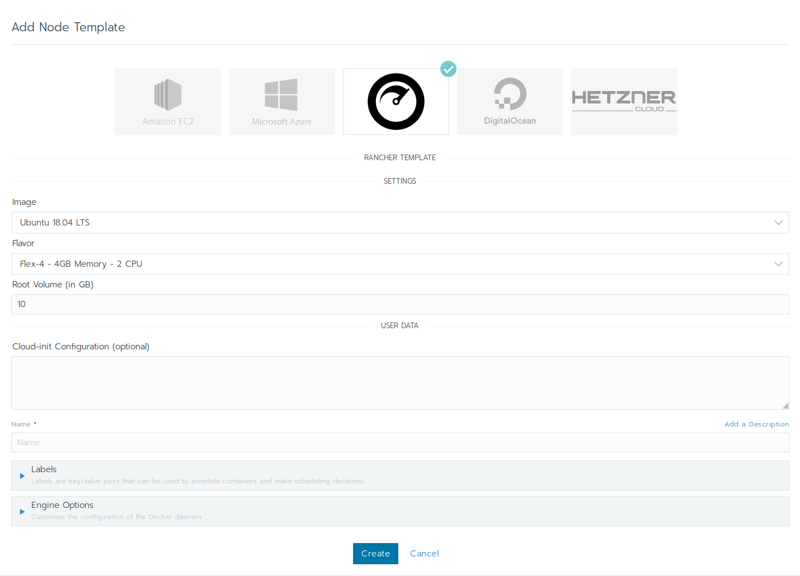

### ⚠️ Repository Archived

**Notice:** This repository has been archived and is now read-only.
No further updates, bug fixes, or feature additions will be made. You can continue to use the published versions.

Please contact [support@cloudscale.ch](mailto:support@cloudscale.ch) if you have any questions.

Why was this repository archived, and what alternatives are offered?

- The [docker/machine](https://github.com/docker/machine) project was archived in September 2021.
- [RKEv1](https://www.suse.com/c/rke-end-of-life-by-july-2025-replatform-to-rke2-or-k3s/) has reached EOL in July 2025.

# Rancher 2 cloudscale.ch UI Driver

Rancher 2 UI driver for the [cloudscale.ch](https://www.cloudscale.ch) IaaS platform.

## Using the cloudscale.ch UI Driver

See the Rancher Documentation on [how to add a node driver](https://rancher.com/docs/rancher/v2.6/en/admin-settings/drivers/node-drivers/) to your installation. The relevant part is in 'Adding Custom Node Drivers':

1. From the navigation expandable from the top left, choose Global Apps > Cluster Management. Then navigate to Clusters > Drivers. From the Drivers page, select the Node Drivers tab.
1. Click Add Node Driver or just activate the driver if the "Cloudscale" driver is already present.
1. Complete the Add Node Driver form. Then click Create:

    | Key               | Value |
    | ----------------- | ----- |
    | Download URL      | `https://github.com/cloudscale-ch/docker-machine-driver-cloudscale/releases/download/v1.2.0/docker-machine-driver-cloudscale_v1.2.0_linux_amd64.tar.gz` |
    | Custom UI URL     | `https://objects.rma.cloudscale.ch/cloudscale-rancher-v2-ui-driver/component.js` |
    | Whitelist Domains | `objects.rma.cloudscale.ch` |
    
    Hint: When updating the driver, you might need to clone your node templates to ensure they use the updated driver version. 

1. Wait for the driver to become "Active"
1. From the Sidebar, choose Global Apps > Cluster Management. Then click Create. The driver and custom UI should show up.

## Development

This package contains a small web-server that will serve up the custom driver UI at `http://localhost:3000/component.js`. You can run this while developing and point the Rancher settings there.
* `npm start`
* The driver name can be optionally overridden: `npm start -- --name=DRIVERNAME`
* The compiled files are viewable at http://localhost:3000.
* **Note:** The development server does not currently automatically restart when files are changed.

## Building

For other users to see your driver, you need to build it and host the output on a server accessible from their browsers.

* `npm run build`
* Copy the contents of the `dist` directory onto a webserver.
  * If your Rancher is configured to use HA or SSL, the server must also be available via HTTPS.

## Credits
This driver is based on the great work of:
* [splattner](https://github.com/splattner) from [Puzzle ITC](https://github.com/puzzleitc)
