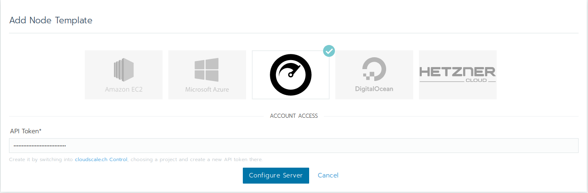

# Rancher 2 cloudscale.ch UI Driver

Rancher 2 UI driver for the [cloudscale.ch Cloud](cloudscale.ch)

## Using

* Add a Machine Driver in Rancher 2 (Global -> Node Drivers)

| Key | Value |
| --- | ----- |
| Download URL | `https://github.com/splattner/docker-machine-driver-cloudscale/releases/download/v0.0.1/docker-machine-driver-cloudscale_v0.0.1_linux_amd64.tar.gz` |
| Custom UI URL | `https://s3.eu-central-1.amazonaws.com/cloudscale-stuff/component.js` |
| Whitelist Domains |  `s3.eu-central-1.amazonaws.com` |

* Wait for the driver to become "Active"
* Go to Clusters -> Add Cluster, your driver and custom UI should show up.

## Development

This package contains a small web-server that will serve up the custom driver UI at `http://localhost:3000/component.js`. You can run this while developing and point the Rancher settings there.
* `npm start`
* The driver name can be optionally overridden: `npm start -- --name=DRIVERNAME`
* The compiled files are viewable at http://localhost:3000.
* **Note:** The development server does not currently automatically restart when files are changed.

## Building

For other users to see your driver, you need to build it and host the output on a server accessible from their browsers.

* `npm run build`
* Copy the contents of the `dist` directory onto a webserver.
  * If your Rancher is configured to use HA or SSL, the server must also be available via HTTPS.
